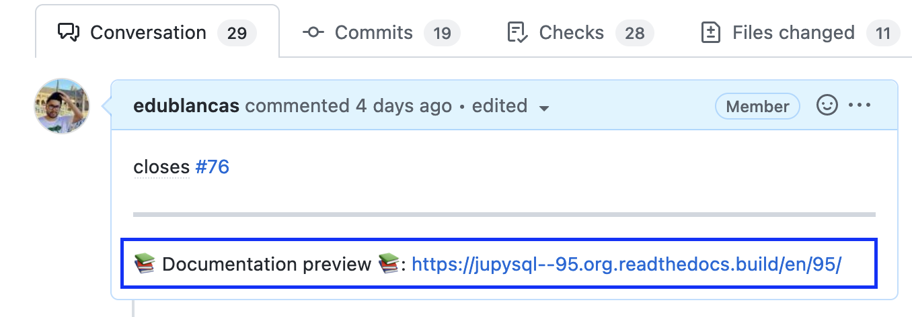
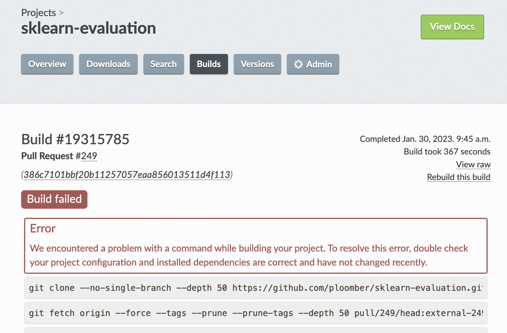

# How we write docs

This guide explains the framework we use for writing documentation for all our projects.

## Classification

We can classify the resource types into four groups:

- Getting started: Provide a quick route to begin using the project; their objective is to teach the basics to get started.
- User Guide: Provide in-depth walkthroughs to use the project; they are more advanced versions than the "Getting started" guides, but their primary purpose is also teaching.
- How-to: Recipes to achieve a specific goal. They provide short and to-the-point examples to perform common tasks. Their objective is to be a shortcut so the user doesn't have to gather all the pieces from reading the API reference.
- API reference: They provide detailed documentation about the project's API. They are automatically generated from docstrings and document function arguments. They also contain basic examples that users can copy paste.

The following sections describe each group in more detail.

## Getting started

We write these tutorials as Jupyter notebooks; this makes authoring easier and allows users to download and try them with Binder. The language should be pretty straightforward, and we should omit non-essential details; the objective here is to teach the absolute basics.

Depending on the project, sometimes we might decide to have a single notebook be the "Getting started" tutorial; other times, we might have multiple ones, for example, one for each module.

### Guidelines

doc/requirements.txt (or doc/environment.yml) should contain all the dependencies required to run the notebooks with notes specifying if a specific library is only used for a particular notebook so we can remove it if we remove the notebook.

## User Guide

The User Guide aims to bring the user to a proficiency level where they feel comfortable with the library. After learning the User Guide, they should be able to perform tasks, tweak the simplest parameters, and understand the project's structure.

As with "Getting Started", these are Jupyter notebooks, and we'll decide on a case-by-case basis for organizing them: if it'll be a single notebook or multiple ones.

In cases where the library requires technical concepts (sklearn-evaluation is an excellent example since the docs assume it is familiar with Machine Learning concepts), the User Guide should explain these concepts. Explaining concepts in detail and with clarity will help us acquire users via search engines like Google.

## How-to

These are code snippets that users can copy-paste. We should pay attention to finding common patterns; once we identify them, we can create snippets and add them to the How-To so users can quickly find them and get things done.

A great idea to find patterns is to search on Stack Overflow for popular questions. Finding popular Stack Overflow questions will tell us what people are trying to do. For example, sklearn-evaluation provides a function to plot a confusion matrix; if we search "confusion matrix" we'll find questions such as "How do I plot a normalized confusion matrix?" or "How do I plot a multiclass confusion matrix?", both of them are good candidates to be included as recipes in our How-To guides.

If the recipes are simple, they should be included in the docstrings of the relevant functions/classes (and they [should be tested as part of the CI](https://docs.pytest.org/en/7.1.x/how-to/doctest.html)). When the recipes are more ellaborated (e.g., they require some setup that needs explanation, other packages, or multiple modules), we can create a *How-To guide* section in the documentation and add them as notebooks.

## API Reference

- All public functions and methods should be documented. We use the [numpydoc](https://numpydoc.readthedocs.io/en/latest/format.html) format
- At least one example (that users can copy paste) should be provided

## Tools

We're migrating all our documentation websites to [Jupyterbook](https://jupyterbook.org/en/stable/intro.html); however, some still use Sphinx.

## General Guidelines

### Style

Writing documentation is hard, so ensure you proofread several times and use tools like Grammarly to simplify writing.

### Naming

The names of the sections should be about what the user knows, not about the library's internals. For example, sklearn-evaluation has a `plot` module to create Machine Learning model evaluation plots. However, the practitioner might not know what plot they need; but they know what to achieve. So we should name our documentation sections accordingly (e.g., name a User Guide "Evaluating Feature Importances" instead of the plot name).

### Hyperlinks

Sections should be hyperlinked. For example, the API reference should link to the relevant Getting Started and User Guides. Furthermore, the Getting Started and User Guide should connect to specific parts of the API reference. For example, if the User Guide describes the use of the `plot.confusion_matrix` function, it should link to its documentation.

### Notebooks (applies to Getting Started and User Guide)

> For instructions on setting up your environment for writing notebooks, [click here](../documentation/notebooks.md)

- Notebooks should not hide any important details (e.g., hiding cells) since users are expected to copy and paste the code on them
- In some cases (e.g., when output is too verbose), we might decide to hide some outputs, but we should be cautious of these
- When notebooks require optional dependencies, we should document them at the top of the file so that users can install the appropriate libraries (e.g., a top cell with: `%pip install somepackage --quiet`)
- The notebook should be organized into short sections so that users can navigate to any specific one. The titles should be short but descriptive enough
- Since we'll run the notebooks as part of the documentation compilation process, all of them should run fast (ideally, below 10 seconds)
- If notebooks require external files we should include both a link to the file and a command to download it (e.g., `curl -O https://ploomber.io/{{some-file}}`)

### New features and breaking API changes

Whenever we introduce (or change) a feature, the version number where the feature was introduced should be documented (in notebooks and API reference). We can do this via the `.. versionadded`, `.. deprecated` and `.. versionchanged` [Sphinx directives.](https://www.sphinx-doc.org/en/master/usage/restructuredtext/directives.html#directive-versionadded)
For minor changes, we give a grace of 2 minor versions to the users, i.e. if we've implemented in 0.8.5, we should add a `.. deprecated:: 0.8.7`.
The deprecation piece is currently manual, so in case you've added those flags, please open a git issue to remove the old feature (we will automate it into the CI at some stage).

## Previewing docs

The easiest way to preview your docs is to open a draft Pull Request. Each PR triggers a pull request so after a few minutes of opening it, you'll see it at the bottom:

To preview the docs, click on `Details` on the right side of the `docs/readthedocs.org:{pkg-name}` job, or click in the link that's automatically added to the first comment:

If the build isn't successful, you'll see a ❌ instead of a ✅, clicking on details will take you to the logs:

If it's unclear why the docs are failing, post a message in the PR with the link to the logs and we'll help you debugging.

## Resources

- [The documentation system](https://documentation.divio.com/)
